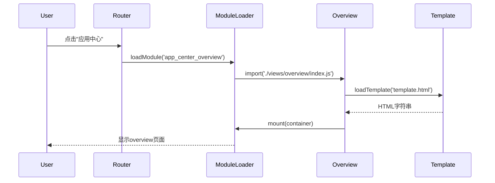

# Design Document: App Center Overview

## Overview

本设计文档描述了为app_center模块添加overview页面的技术实现方案。该方案确保app_center与其他三个模块(sops、amz_hub、more)采用完全一致的架构模式，包括统一的模块加载机制、路由配置、页面结构和交互行为。

### 设计目标

1. **架构一致性**: 与sops、amz_hub、more保持完全相同的代码结构和实现模式
2. **可维护性**: 清晰的文件组织和标准化的函数接口
3. **可扩展性**: 便于未来添加新的子应用到app_center
4. **用户体验**: 提供直观的总览页面，快速访问所有子应用

### 技术栈

- **JavaScript**: ES6+ 模块化语法
- **HTML**: 语义化模板结构
- **CSS**: Tailwind CSS 实用类
- **动态导入**: ES6 dynamic import
- **模板加载**: loadTemplate工具或Vite的?raw导入

## Architecture

### 整体架构

App_center模块采用与其他模块一致的三层架构：

```
app_center/
├── app_center.js           # 模块入口，配置ModuleLoader
├── app_center.html         # 模块容器HTML
├── app_center_style.css    # 模块样式
└── views/
    ├── overview/           # 总览页面
    │   ├── index.js        # 页面逻辑
    │   └── template.html   # 页面模板
    ├── master_prompt/      # 子应用1
    └── keyword_hunter/     # 子应用2
```

### 模块加载流程



### 路由配置架构

```
MenuConfig (menuConfig.js)
├── contexts.apps          # 顶层上下文
├── modules.master_prompt  # 子应用模块1
├── modules.keyword_tracker # 子应用模块2
├── appCategories          # 新增：应用分类
│   └── apps               # 应用分类
└── routes
    ├── app_center_overview # 新增：总览路由
    ├── scraper            # 子应用路由
    ├── data
    ├── analysis
    ├── promptlab
    ├── kw_input
    ├── kw_process
    └── kw_analysis
```

## Components and Interfaces

### 1. Overview页面模块 (views/overview/index.js)

**职责**: 管理overview页面的生命周期和交互

**导出接口**:

```javascript
/**
 * 挂载overview页面
 * @param {HTMLElement} container - 容器DOM元素
 * @returns {Promise<void>}
 */
export async function mount(container)

/**
 * 卸载overview页面
 * @returns {void}
 */
export function unmount()

/**
 * 滚动到指定分类区域
 * @param {string} categoryId - 分类ID (如'apps')
 * @returns {void}
 */
export function scrollToModule(categoryId)
```

**实现细节**:

```javascript
// 方案A: 使用loadTemplate (与sops、more一致)
import { loadTemplate } from "../../../../common/utils/viewLoader.js";

export async function mount(container) {
    const html = await loadTemplate('src/modules/app_center/views/overview/template.html');
    container.innerHTML = html;
    container.classList.add('fade-in');
    initOverviewEvents(container);
    console.log("✅ App Center 总览模块已挂载");
}

// 方案B: 使用Vite ?raw导入 (与amz_hub一致)
import templateHTML from './template.html?raw';

export async function mount(container) {
    container.innerHTML = templateHTML;
    initOverviewEvents(container);
    console.log("✅ App Center 总览模块已挂载");
}
```

**推荐方案**: 方案A (loadTemplate)，因为sops和more都使用此方式，保持多数一致性。

### 2. MODULE_MAP扩展 (app_center.js)

**修改内容**:

```javascript
const MODULE_MAP = {
    // 新增：总览页面路由
    'app_center_overview': () => import('./views/overview/index.js'),
    
    // 现有路由
    'scraper': () => import('./master_prompt/views/scraper/index.js'),
    'data': () => import('./master_prompt/views/data/index.js'),
    'analysis': () => import('./master_prompt/views/analysis/index.js'),
    'promptlab': () => import('./master_prompt/views/promptlab/index.js'),
    'kw_input': () => import('./keyword_hunter/views/input/index.js'),
    'kw_process': () => import('./keyword_hunter/views/process/index.js'),
    'kw_analysis': () => import('./keyword_hunter/views/analysis/index.js'),
};
```

### 3. MenuConfig扩展 (menuConfig.js)

**新增appCategories配置**:

```javascript
// App Center Categories (用于应用中心模块的侧边栏分组)
appCategories: {
    apps: {
        id: 'apps',
        label: '应用工具集',
        icon: 'fas fa-cubes',
        color: 'blue',
        order: 1,
        version: 'v1.0',
        description: '集成数据采集、分析与关键词优化的专业工具套件。'
    }
},
```

**新增overview路由**:

```javascript
routes: {
    // ... 现有路由 ...
    
    // 新增：App Center总览
    app_center_overview: {
        moduleId: 'app_center',  // 注意：这里需要新增app_center模块定义
        label: '应用总览',
        icon: 'fas fa-th-large',
        panelId: 'panel-app_center'
    },
}
```

**注意**: 当前menuConfig.js中没有定义`app_center`模块，只有`master_prompt`和`keyword_tracker`。需要添加：

```javascript
modules: {
    // ... 现有模块 ...
    
    // 新增：App Center容器模块
    app_center: {
        id: 'app_center',
        contextId: 'apps',
        title: '应用中心',
        version: 'v1.0',
        icon: 'fas fa-cubes',
        description: '集成多个专业工具的应用中心，提供数据采集、分析与优化功能。'
    },
}
```

### 4. Overview页面模板 (views/overview/template.html)

**结构设计**:

```html
<div class="app-overview-container">
    <!-- Header Section -->
    <header class="text-center mb-8">
        <h1 class="text-3xl font-extrabold text-slate-900 mb-2">
            <i class="fas fa-cubes text-blue-500 mr-3"></i>应用中心
        </h1>
        <p class="text-slate-600 max-w-3xl mx-auto">
            集成数据采集、管理、AI分析与关键词优化的一站式解决方案
        </p>
    </header>

    <!-- 使用指南 -->
    <div class="bg-gradient-to-br from-slate-50 to-blue-50 border border-slate-200 rounded-2xl p-6 mb-8">
        <!-- 核心价值主张 -->
        <!-- 推荐使用路径 -->
        <!-- 快速入口 -->
    </div>

    <!-- Module Section: 应用工具集 -->
    <section id="app-module-apps" class="mb-10">
        <div class="app-module-section">
            <div class="flex items-center gap-3 mb-4">
                <div class="w-10 h-10 bg-blue-100 rounded-lg flex items-center justify-center text-blue-600">
                    <i class="fas fa-cubes"></i>
                </div>
                <div>
                    <h2 class="text-xl font-bold text-slate-800">应用工具集</h2>
                    <p class="text-sm text-slate-500">集成数据采集、分析与关键词优化的专业工具套件</p>
                </div>
            </div>
            <div class="app-card-grid">
                <!-- Master Prompt 卡片 -->
                <!-- Keyword Hunter 卡片 -->
            </div>
        </div>
    </section>

    <!-- Quick Stats -->
    <div class="mt-8 grid grid-cols-2 gap-4">
        <!-- 统计信息 -->
    </div>
</div>
```

### 5. 事件处理函数

**initOverviewEvents函数**:

```javascript
function initOverviewEvents(container) {
    // 1. 子应用卡片点击事件
    const appCards = container.querySelectorAll('[data-action="switch-tab"]');
    appCards.forEach(card => {
        card.addEventListener('click', () => {
            const targetTab = card.dataset.tab;
            // 触发路由切换（由全局路由系统处理）
            window.dispatchEvent(new CustomEvent('route-change', {
                detail: { routeId: targetTab }
            }));
        });
    });

    // 2. 快速入口按钮点击事件
    const quickLinks = container.querySelectorAll('[data-quick-link]');
    quickLinks.forEach(link => {
        link.addEventListener('click', () => {
            const targetRoute = link.dataset.quickLink;
            window.dispatchEvent(new CustomEvent('route-change', {
                detail: { routeId: targetRoute }
            }));
        });
    });
}
```

## Data Models

### 1. AppCategory数据结构

```javascript
{
    id: string,           // 分类唯一标识，如'apps'
    label: string,        // 显示名称，如'应用工具集'
    icon: string,         // Font Awesome图标类名
    color: string,        // 主题颜色，如'blue'
    order: number,        // 排序顺序
    version: string,      // 版本号
    description: string   // 分类描述
}
```

### 2. SubApp数据结构

```javascript
{
    id: string,           // 子应用ID，如'master_prompt'
    name: string,         // 显示名称
    icon: string,         // 图标类名
    description: string,  // 功能描述
    version: string,      // 版本号
    status: string,       // 状态：'active' | 'beta' | 'coming-soon'
    routes: string[],     // 包含的路由ID列表
    category: string      // 所属分类ID
}
```

### 3. Route数据结构

```javascript
{
    moduleId: string,     // 所属模块ID
    label: string,        // 路由显示名称
    icon: string,         // 图标类名
    panelId: string,      // 目标面板ID
    category?: string     // 可选：所属分类
}
```

## Correctness Properties

*属性是一种特征或行为，应该在系统的所有有效执行中保持为真——本质上是关于系统应该做什么的形式化陈述。属性作为人类可读规范和机器可验证正确性保证之间的桥梁。*

### Property 1: 模块接口完整性

*对于任何* overview模块的导出对象，它必须包含mount、unmount和scrollToModule三个函数，并且这些函数都是可调用的。

**Validates: Requirements 1.2**

### Property 2: 挂载渲染正确性

*对于任何* 有效的DOM容器元素，调用overview模块的mount函数后，容器的innerHTML应该包含来自template.html的内容，并且容器应该具有'fade-in' CSS类。

**Validates: Requirements 1.4**

### Property 3: 分类配置完整性

*对于任何* appCategories中定义的分类对象，它必须包含id、label、icon、color、order、version和description这七个必需字段。

**Validates: Requirements 3.3**

### Property 4: 结构一致性

*对于任何* categories配置对象（sopCategories、hubCategories、moreCategories、appCategories），它们的字段结构（字段名称集合）应该完全相同。

**Validates: Requirements 3.4**

### Property 5: 卡片内容完整性

*对于任何* overview页面中的子应用卡片元素，它必须同时满足：
1. 包含应用名称、图标、描述和状态标识的可见内容
2. 具有data-action="switch-tab"和data-tab属性用于导航

**Validates: Requirements 4.3, 8.2**

### Property 6: 卡片点击导航

*对于任何* 带有data-action="switch-tab"属性的卡片元素，当触发点击事件时，系统应该派发一个包含正确routeId的'route-change'自定义事件。

**Validates: Requirements 4.4**

### Property 7: 动态注册功能

*对于任何* 有效的路由ID和模块加载函数，调用registerSubModule(routeId, loader)后，MODULE_MAP应该包含该路由项，并且后续可以通过该路由ID成功加载模块。

**Validates: Requirements 6.4**

### Property 8: 滚动功能

*对于任何* 在overview页面中存在的分类ID，调用scrollToModule(categoryId)应该使对应的section元素滚动到可视区域，并临时添加高亮CSS类。

**Validates: Requirements 8.5**


## Error Handling

### 1. 模板加载失败

**场景**: template.html文件不存在或加载失败

**处理策略**:
```javascript
export async function mount(container) {
    try {
        const html = await loadTemplate('src/modules/app_center/views/overview/template.html');
        container.innerHTML = html;
        container.classList.add('fade-in');
        initOverviewEvents(container);
        console.log("✅ App Center 总览模块已挂载");
    } catch (error) {
        console.error("❌ App Center 总览页面加载失败:", error);
        container.innerHTML = `
            <div class="p-10 text-center text-red-500">
                <i class="fas fa-exclamation-triangle text-4xl mb-4"></i>
                <p>页面加载失败，请刷新重试</p>
            </div>
        `;
    }
}
```

### 2. 容器元素无效

**场景**: mount函数接收到null或非DOM元素

**处理策略**:
```javascript
export async function mount(container) {
    if (!container || !(container instanceof HTMLElement)) {
        console.error("❌ 无效的容器元素:", container);
        throw new Error("mount函数需要有效的HTMLElement作为参数");
    }
    // ... 正常挂载逻辑
}
```

### 3. scrollToModule目标不存在

**场景**: 调用scrollToModule时传入的categoryId对应的元素不存在

**处理策略**:
```javascript
export function scrollToModule(categoryId) {
    if (!categoryId) {
        console.warn('⚠️ scrollToModule: categoryId为空');
        return;
    }
    
    const moduleId = `app-module-${categoryId}`;
    const moduleElement = document.getElementById(moduleId);
    
    if (moduleElement) {
        moduleElement.scrollIntoView({ 
            behavior: 'smooth', 
            block: 'start',
            inline: 'nearest'
        });
        
        moduleElement.classList.add('app-module-highlight');
        setTimeout(() => {
            moduleElement.classList.remove('app-module-highlight');
        }, 2000);
        
        console.log(`✅ 滚动到模块: ${categoryId}`);
    } else {
        console.warn(`⚠️ 未找到模块元素: ${moduleId}`);
    }
}
```

### 4. 事件监听器初始化失败

**场景**: initOverviewEvents中查询不到预期的DOM元素

**处理策略**:
```javascript
function initOverviewEvents(container) {
    const appCards = container.querySelectorAll('[data-action="switch-tab"]');
    
    if (appCards.length === 0) {
        console.warn('⚠️ 未找到任何可点击的应用卡片');
    }
    
    appCards.forEach(card => {
        try {
            card.addEventListener('click', () => {
                const targetTab = card.dataset.tab;
                if (!targetTab) {
                    console.error('❌ 卡片缺少data-tab属性:', card);
                    return;
                }
                window.dispatchEvent(new CustomEvent('route-change', {
                    detail: { routeId: targetTab }
                }));
            });
        } catch (error) {
            console.error('❌ 添加事件监听器失败:', error);
        }
    });
}
```

### 5. 动态注册冲突

**场景**: registerSubModule尝试注册已存在的路由ID

**处理策略**:
```javascript
export function registerSubModule(routeId, loader) {
    if (MODULE_MAP[routeId]) {
        console.warn(`⚠️ 路由 "${routeId}" 已存在，跳过注册`);
        return false;
    }
    
    if (typeof loader !== 'function') {
        console.error(`❌ 无效的loader函数:`, loader);
        return false;
    }
    
    MODULE_MAP[routeId] = loader;
    console.log(`✅ 动态注册子模块: ${routeId}`);
    return true;
}
```

## Testing Strategy

### 测试方法论

本项目采用**双重测试策略**，结合单元测试和属性测试，确保全面的代码覆盖和正确性验证：

- **单元测试**: 验证具体示例、边界情况和错误条件
- **属性测试**: 验证跨所有输入的通用属性
- 两者互补：单元测试捕获具体bug，属性测试验证通用正确性

### 属性测试配置

**测试库选择**: 由于项目使用JavaScript，推荐使用 **fast-check** 作为属性测试库。

**配置要求**:
- 每个属性测试最少运行 **100次迭代**
- 每个测试必须通过注释引用设计文档中的属性
- 标签格式: `// Feature: app-center-overview, Property {number}: {property_text}`

### 测试计划

#### 1. 单元测试

**测试文件**: `test/app_center/overview.test.js`

**测试用例**:

```javascript
describe('App Center Overview - Unit Tests', () => {
    describe('默认路由行为', () => {
        test('导航到app_center时应显示overview页面', async () => {
            // Validates: Requirements 1.1
            // 测试默认路由加载overview
        });
    });
    
    describe('模板加载', () => {
        test('template.html文件应存在', () => {
            // Validates: Requirements 1.3
            // 验证文件存在性
        });
    });
    
    describe('配置完整性', () => {
        test('MODULE_MAP应包含app_center_overview路由', () => {
            // Validates: Requirements 2.1
            // 检查配置对象
        });
        
        test('MENU_CONFIG应包含appCategories', () => {
            // Validates: Requirements 3.1
            // 检查菜单配置
        });
        
        test('appCategories应至少包含一个分类', () => {
            // Validates: Requirements 3.2
            // 检查最小配置要求
        });
    });
    
    describe('UI内容', () => {
        test('overview页面应显示标题和描述', async () => {
            // Validates: Requirements 4.1
            // 验证关键UI元素存在
        });
        
        test('应显示子应用统计信息', async () => {
            // Validates: Requirements 4.5
            // 验证统计数字正确
        });
    });
    
    describe('样式配置', () => {
        test('关键元素应使用蓝色主题', async () => {
            // Validates: Requirements 7.3
            // 检查CSS类
        });
        
        test('卡片容器应使用grid布局', async () => {
            // Validates: Requirements 7.4
            // 检查布局类
        });
    });
    
    describe('ModuleLoader配置', () => {
        test('应包含所有必需的配置参数', () => {
            // Validates: Requirements 5.2
            // 验证createModuleLoader调用参数
        });
    });
});
```

#### 2. 属性测试

**测试文件**: `test/app_center/overview.properties.test.js`

**测试用例**:

```javascript
import fc from 'fast-check';

describe('App Center Overview - Property Tests', () => {
    
    test('Property 1: 模块接口完整性', () => {
        // Feature: app-center-overview, Property 1: 对于任何overview模块的导出对象，它必须包含mount、unmount和scrollToModule三个函数
        
        const overviewModule = require('../src/modules/app_center/views/overview/index.js');
        
        expect(overviewModule).toHaveProperty('mount');
        expect(overviewModule).toHaveProperty('unmount');
        expect(overviewModule).toHaveProperty('scrollToModule');
        
        expect(typeof overviewModule.mount).toBe('function');
        expect(typeof overviewModule.unmount).toBe('function');
        expect(typeof overviewModule.scrollToModule).toBe('function');
    });
    
    test('Property 2: 挂载渲染正确性', async () => {
        // Feature: app-center-overview, Property 2: 对于任何有效的DOM容器元素，调用mount后容器应包含模板内容
        
        await fc.assert(
            fc.asyncProperty(fc.constant(document.createElement('div')), async (container) => {
                const { mount } = require('../src/modules/app_center/views/overview/index.js');
                await mount(container);
                
                expect(container.innerHTML).not.toBe('');
                expect(container.classList.contains('fade-in')).toBe(true);
            }),
            { numRuns: 100 }
        );
    });
    
    test('Property 3: 分类配置完整性', () => {
        // Feature: app-center-overview, Property 3: 对于任何appCategories中的分类对象，必须包含所有必需字段
        
        const { MENU_CONFIG } = require('../src/common/config/menuConfig.js');
        const requiredFields = ['id', 'label', 'icon', 'color', 'order', 'version', 'description'];
        
        Object.values(MENU_CONFIG.appCategories).forEach(category => {
            requiredFields.forEach(field => {
                expect(category).toHaveProperty(field);
                expect(category[field]).toBeDefined();
            });
        });
    });
    
    test('Property 4: 结构一致性', () => {
        // Feature: app-center-overview, Property 4: 所有categories配置的字段结构应该相同
        
        const { MENU_CONFIG } = require('../src/common/config/menuConfig.js');
        
        const getFieldSet = (obj) => new Set(Object.keys(Object.values(obj)[0] || {}));
        
        const sopFields = getFieldSet(MENU_CONFIG.sopCategories);
        const hubFields = getFieldSet(MENU_CONFIG.hubCategories);
        const moreFields = getFieldSet(MENU_CONFIG.moreCategories);
        const appFields = getFieldSet(MENU_CONFIG.appCategories);
        
        expect([...sopFields].sort()).toEqual([...hubFields].sort());
        expect([...hubFields].sort()).toEqual([...moreFields].sort());
        expect([...moreFields].sort()).toEqual([...appFields].sort());
    });
    
    test('Property 5: 卡片内容完整性', async () => {
        // Feature: app-center-overview, Property 5: 对于任何子应用卡片，必须包含必需信息和导航属性
        
        const container = document.createElement('div');
        const { mount } = require('../src/modules/app_center/views/overview/index.js');
        await mount(container);
        
        const cards = container.querySelectorAll('[data-action="switch-tab"]');
        
        cards.forEach(card => {
            // 检查内容
            expect(card.querySelector('h3')).toBeTruthy(); // 应用名称
            expect(card.querySelector('i')).toBeTruthy(); // 图标
            expect(card.querySelector('p')).toBeTruthy(); // 描述
            
            // 检查导航属性
            expect(card.dataset.action).toBe('switch-tab');
            expect(card.dataset.tab).toBeDefined();
            expect(card.dataset.tab).not.toBe('');
        });
    });
    
    test('Property 6: 卡片点击导航', async () => {
        // Feature: app-center-overview, Property 6: 对于任何卡片，点击应触发route-change事件
        
        await fc.assert(
            fc.asyncProperty(fc.constant(null), async () => {
                const container = document.createElement('div');
                const { mount } = require('../src/modules/app_center/views/overview/index.js');
                await mount(container);
                
                const cards = container.querySelectorAll('[data-action="switch-tab"]');
                
                cards.forEach(card => {
                    let eventFired = false;
                    let eventDetail = null;
                    
                    const listener = (e) => {
                        eventFired = true;
                        eventDetail = e.detail;
                    };
                    
                    window.addEventListener('route-change', listener);
                    card.click();
                    window.removeEventListener('route-change', listener);
                    
                    expect(eventFired).toBe(true);
                    expect(eventDetail).toHaveProperty('routeId');
                    expect(eventDetail.routeId).toBe(card.dataset.tab);
                });
            }),
            { numRuns: 100 }
        );
    });
    
    test('Property 7: 动态注册功能', () => {
        // Feature: app-center-overview, Property 7: 对于任何有效的路由ID和加载函数，registerSubModule应成功注册
        
        fc.assert(
            fc.property(
                fc.string({ minLength: 1 }),
                fc.constant(() => Promise.resolve({ mount: () => {}, unmount: () => {} })),
                (routeId, loader) => {
                    const { registerSubModule } = require('../src/modules/app_center/app_center.js');
                    const result = registerSubModule(routeId, loader);
                    
                    expect(typeof result).toBe('boolean');
                    // 如果注册成功，MODULE_MAP应包含该路由
                }
            ),
            { numRuns: 100 }
        );
    });
    
    test('Property 8: 滚动功能', async () => {
        // Feature: app-center-overview, Property 8: 对于任何存在的分类ID，scrollToModule应滚动到对应区域
        
        const container = document.createElement('div');
        document.body.appendChild(container);
        
        const { mount, scrollToModule } = require('../src/modules/app_center/views/overview/index.js');
        await mount(container);
        
        const sections = container.querySelectorAll('[id^="app-module-"]');
        
        sections.forEach(section => {
            const categoryId = section.id.replace('app-module-', '');
            
            // Mock scrollIntoView
            section.scrollIntoView = jest.fn();
            
            scrollToModule(categoryId);
            
            expect(section.scrollIntoView).toHaveBeenCalledWith({
                behavior: 'smooth',
                block: 'start',
                inline: 'nearest'
            });
        });
        
        document.body.removeChild(container);
    });
});
```

### 测试执行

**运行所有测试**:
```bash
npm test
```

**仅运行单元测试**:
```bash
npm test -- test/app_center/overview.test.js
```

**仅运行属性测试**:
```bash
npm test -- test/app_center/overview.properties.test.js
```

**测试覆盖率**:
```bash
npm test -- --coverage
```

### 测试优先级

1. **高优先级**: Property 1, 2, 5, 6 - 核心功能正确性
2. **中优先级**: Property 3, 4, 8 - 配置和交互完整性
3. **低优先级**: Property 7 - 扩展功能

### 持续集成

建议在CI/CD流程中：
1. 每次提交都运行所有测试
2. 要求测试覆盖率 ≥ 80%
3. 所有属性测试必须通过
4. 单元测试失败阻止合并
