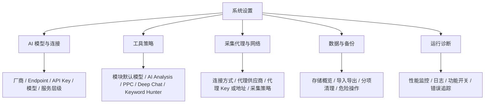

# 系统设置目录结构合理性审查报告

审查日期：2026-07-06  
审查范围：`src/components/settings/systemSettings.ts`、`src/components/settings/systemSettings.html`、`src/components/settings/systemSettings.css`、相关配置/存储服务与模块内设置。  
边界说明：仓库中未发现独立中文目录“系统设置”；当前产品实现为右侧抽屉式全局设置面板，入口为 `index.html` 的“全局设置”按钮，主体为 `src/components/settings/systemSettings.*`。

## Agent A - 现有目录分类合理性审查

| 目录名称 | 当前归属 | 合理性评分 (1-5) | 问题描述 | 优化建议 |
|---|---|---:|---|---|
| 模型配置 | `src/components/settings/systemSettings.html:64`、`settings-section-llm` | 4 | 区内包含 `AI 厂商`、`API Endpoint`、`API Key`、`选择模型`、`服务层级`，实际不只是“模型”。 | [中] 改为“AI 模型与连接”或“LLM 配置”。 |
| 采集网络 | `src/components/settings/systemSettings.html:73`、`settings-section-network` | 3 | `连接方式` 下混合商业 API、直连、自定义 API、HTTP 代理；“采集网络”能表达用途，但对凭据和代理形态覆盖不足。 | [中] 改为“采集代理与网络”，代理 Key/地址保留在该目录内作为受保护字段。 |
| 本地数据 | `src/components/settings/systemSettings.html:82`、`settings-section-data` | 4 | 覆盖 `localStorage`、`IndexedDB`、导入导出、分项清理和 `清空全部`，范围偏大。 | [高] 改为“数据与备份”，将 `清空全部` 放入本目录下的“危险操作”分组。 |
| 性能监控 | `src/components/settings/systemSettings.html:91`、`settings-section-performance` | 4 | `打开监控面板` 还包含错误追踪、用户行为分析，名称略窄。 | [中] 改为“运行诊断”，性能监控作为其中一项。 |
| 配置与偏好 | `LOCAL_DATA_BUCKET_META.config`，`src/components/settings/systemSettings.ts:230` | 3 | 描述为“模型、网络、布局和功能开关”，但实际还归类 `performance_metrics`、`debug_events`、`ppc_` 前缀等。 | [中] 改为“系统配置与偏好”，后续拆出“诊断数据/工具配置”。 |
| 密钥 | `LOCAL_DATA_BUCKET_META.secrets`，`src/components/settings/systemSettings.ts:239` | 3 | 实际覆盖 `llm_key_*`、`proxy_config`、`proxy_key_map`、`scraper_proxy_config`，既有密钥也有代理配置。 | [高] 改为“密钥与代理凭据”，或将代理类型配置与凭据拆分。 |
| 工作台状态 | `LOCAL_DATA_BUCKET_META.workspace-state`，`src/components/settings/systemSettings.ts:248` | 3 | 描述包含 PromptLab 与关键词工具状态，但另有“关键词历史”，边界不够直观。 | [中] 改为“工作台临时状态”，强调不包含历史记录。 |
| 采集历史 | `LOCAL_DATA_BUCKET_META.scrape-history`，`src/components/settings/systemSettings.ts:258` | 4 | 包含商品采集结果、导入记录、历史报告；但实际键含 `amzf_search_history`，与关键词/搜索历史易混。 | [低] 改为“采集与报告历史”。 |
| 聊天记录 | `LOCAL_DATA_BUCKET_META.chat-history`，`src/components/settings/systemSettings.ts:267` | 5 | 与 Playground 对话线程和上下文高度匹配，无明显重叠。 | [低] 可保持，或命名为“Playground 聊天记录”。 |
| 关键词历史 | `LOCAL_DATA_BUCKET_META.keyword-history`，`src/components/settings/systemSettings.ts:276` | 4 | 与 Keyword Hunter 快照、对比记录匹配；和 `amzf_search_history` 存在轻微认知重叠。 | [低] 改为“Keyword Hunter 历史”。 |
| 缓存 | `LOCAL_DATA_BUCKET_META.cache`，`src/components/settings/systemSettings.ts:285` | 5 | 页面模板、HTTP 响应、AI 分析缓存均符合“缓存”语义。 | [低] 保持。 |
| 其它数据 | `LOCAL_DATA_BUCKET_META.other`，`src/components/settings/systemSettings.ts:294` | 2 | “尚未归类的本地业务数据”语义弱，用户难判断清理影响。 | [高] 改为“未归类数据（谨慎）”，并逐步减少兜底项。 |

## Agent B - 遗漏设置项识别

| 设置项名称 | 当前位置 | 建议纳入理由 | 优先级 (高/中/低) |
|---|---|---|---|
| 采集运行策略：`scraper.requestTimeout`、`maxConcurrent`、`maxRetries`、`batchSize`、`cacheDuration` | `src/common/config/ConfigCenter.ts:200`；使用处 `src/modules/app_center/views/master_analysis/services/scraperService.ts` | 当前只配置采集代理，未覆盖超时、并发、重试、缓存 TTL；直接影响反爬风险和采集稳定性。 | 高 |
| LLM 调用策略：`llm.defaultTimeout`、`analysisTimeout`、`maxRetries`、`retryDelay` | `src/common/config/ConfigCenter.ts:209`；使用处 `src/services/llmService.ts` | 设置页有模型连接，但无超时/重试/长任务策略；影响成本、失败率和用户等待。 | 高 |
| 模块级默认模型：AI Analysis、PPC 分析、Deep Chat、Keyword Hunter | `src/modules/app_center/views/master_analysis/ai_analysis/services/aiAnalysisService.ts:92`、`src/modules/app_center/views/ppc_tools/ppc_search_terms/services/llmAnalysisService.ts:445`、`src/modules/app_center/views/playground/deep-chat/controller.ts:1327`、`src/modules/app_center/views/keyword_hunter/services/trackerService.ts:537` | 当前多模块默认回落到全局 `config.model` 或首个模型；建议纳入“工具策略”，允许每个模块设置独立默认模型，帮助用户在任务质量、响应速度和成本之间平衡。 | 高 |
| 全局 HTTP：`api.baseUrl`、`api.timeout`、`retryAttempts`、`retryDelay` | `src/common/config/ConfigCenter.ts:182`；使用处 `src/services/httpService.ts` | 运维级全局配置，当前只能通过代码/环境调整。 | 高 |
| 存储策略：`storage.lruMaxSize`、`lruWarningThreshold`、`lruCleanupRatio`、`historyMaxItems` | `src/common/config/ConfigCenter.ts:227`；部分硬编码在 `src/services/storageService.ts` | 设置页只有清理动作，没有数据保留策略；且历史数量存在重复来源。 | 高 |
| 日志与监控上报：`logger.maxLogs`、`minLevel`、`batchSize`、`remoteEndpoint` | `src/common/config/ConfigCenter.ts:221`；`src/services/loggerService.ts` | 属于运维/诊断配置，当前未可视化。 | 高 |
| 用户行为分析：`analytics.enabled`、`sampleRate`、`endpoint` | `src/services/analyticsService.ts` | 涉及隐私、性能和合规，应纳入“诊断/隐私”或至少显示状态。 | 高 |
| 错误追踪：`errorTracker.enabled`、`sampleRate`、`reportEndpoint` | `src/services/errorTracker.ts` | 错误上报是安全/运维敏感项，当前无统一入口。 | 高 |
| 功能开关：`features.enableExperimentalFeatures`、`enableBetaFeatures`、`enableDebugMode`、`feature_*` | `src/common/config/ConfigCenter.ts:194`；`src/services/featureFlagService.ts:17` | 已有功能开关机制，但设置页没有高级/实验功能管理入口。待决策：是否对普通用户开放。 | 高 |
| 端点安全策略：`API_ENDPOINTS.isDangerous`、`requiresProxy`、CSP 连接域 | `src/common/config/apiEndpoints.ts:43`；部署边界见 `docs/DEPLOYMENT.md` | 生产直连限制、危险端点和 CSP 域名影响安全策略，建议在“AI 模型与连接”或“采集代理与网络”内展示只读状态。 | 高 |
| AI 分析性能：`ai_analysis_performance_settings` 的 `schedulingPreference`、`enableCache` | `src/modules/app_center/views/master_analysis/ai_analysis/components/PerformanceSettings.ts:17` | 已有模块内设置；若目标是统一 AI 成本/速度治理，应上收到系统设置。待决策。 | 中 |
| AI 分析并发/缓存/token：`MAX_ANALYSIS_CONCURRENCY`、`ANALYSIS_CACHE_TTL_MS`、`maxTokens` | `src/modules/app_center/views/master_analysis/ai_analysis/services/parallelAnalysisService.ts`、`src/modules/app_center/views/master_analysis/services/llmOutputBudget.ts` | 成本与吞吐关键参数，部分仍隐藏在代码中。 | 高 |
| PPC LLM 批处理与缓存：`PPC_BATCH_SIZE`、`PPC_MAX_CONCURRENT_BATCHES`、`PPC_LLM_CACHE_TTL_MS` | `src/modules/app_center/views/ppc_tools/ppc_search_terms/services/llmAnalysisService.ts` | PPC Agent 成本/性能关键参数，建议统一到“AI 策略”或“工具策略”。 | 高 |
| PPC 业务阈值：`targetAcos`、`highAcos`、`minClicksNoOrder`、`minSpendNoOrder`、`minCtr` | `src/modules/app_center/views/ppc_tools/ppc_search_terms/settings/thresholdFields.ts:13`；持久化 `thresholdSettings.ts:15` | 已有模块内面板；若属于公司默认广告策略，可上收为“工具策略”。待决策。 | 中 |
| PPC 分析开关：`useAgent`、`allowLocalFallback`、`useContext` | `src/modules/app_center/views/ppc_tools/ppc_search_terms/settings/analysisSettings.ts:6` | 影响是否调用 LLM、是否允许本地回退，属于成本/质量开关。待决策。 | 中 |
| Deep Chat 请求预算与上下文窗口 | `src/modules/app_center/views/playground/deep-chat/requestBudget.ts`、`conversationContext.ts` | 控制上下文裁剪、输入/输出 token，直接影响成本与可用性。 | 高 |
| Keyword Hunter LLM 缓存与 token 参数 | `src/modules/app_center/views/keyword_hunter/services/trackerService.ts` | 关键词分析/翻译成本和缓存策略未统一治理。 | 高 |
| Keyword Hunter 匹配偏好：`matchPlural`、`matchStem`、`matchCase`、`matchPartial` | `src/stores/useAppStore.ts:186` | 用户可配置匹配偏好，是否作为全局默认值需产品决策。 | 中 |
| Deep Chat 会话/草稿保留数 | `src/modules/app_center/views/playground/deep-chat/constants.ts` | 用户可感知的数据保留偏好，当前不在系统设置。 | 中 |
| 性能告警阈值与保留策略 | `src/services/alertService.ts`、`src/services/webVitalsService.ts`、`src/services/performanceStorage.ts` | 性能监控入口存在，但阈值、保留周期、通知方式不可配置。 | 中 |
| 模块加载重试/超时 | `src/common/infrastructure/SafeModuleLoader.ts` | 影响页面稳定性，可作为高级诊断项，不建议普通用户直接调整。 | 中 |
| 事件调试开关 `debug_events` 与旧 Action 警告 `enable_legacy_warnings` | `src/common/utils/eventLogger.ts:36`、`src/common/utils/actionRegistry.ts` | 属于开发/诊断开关，适合放入“运行诊断”。 | 中/低 |
| 动画偏好：`enabled`、`speed`、`respectSystemPreference` | `src/config/animation-config.ts:22`、`src/stores/animation-settings.ts` | 已有持久化偏好但无系统设置入口；偏 UX，优先级较低。 | 低 |
| 主题偏好 `app-theme` / `app_theme` | `src/common/config/themeConfig.ts:118`、`src/common/config/themes.ts:262` | 典型用户偏好，但当前系统设置只覆盖模型/网络/数据/监控。 | 低 |
| SOPS 各模块默认负责人/审核人 | 代表：`src/modules/sops/views/backend/fba_shipping/index.ts:11`、`src/modules/sops/views/safety/account_security/index.ts:11`、`src/modules/sops/views/service/negative_review/index.ts:11` | 多模块本地持久化负责人。待决策：若组织需要统一默认 Owner，可纳入“工作流默认值”。 | 低 |

## Agent C - 横向对标分析

### 对标产品列表及结构摘要

- GitHub Settings：按个人账号、组织、仓库三个作用域组织；账号侧覆盖主题、安全、可访问性等，组织侧覆盖成员、角色、仓库访问、团队、程序化访问、组织设置、组织安全，仓库侧再按功能、Actions、安全、可见性与访问拆分。参考 GitHub 官方文档：[Account settings](https://docs.github.com/en/account-and-profile/how-tos/account-settings)、[Organizations](https://docs.github.com/en/organizations)、[Repository settings](https://docs.github.com/en/repositories/managing-your-repositorys-settings-and-features)。
- Notion Settings：按账号偏好、Workspace、成员/访客、安全、导出/分析、连接、计费、删除等组织；企业版安全策略集中在 Security。参考 Notion 官方文档：[Account settings](https://www.notion.com/help/account-settings)、[Workspace settings](https://www.notion.com/help/workspace-settings)。
- Slack Admin：Workspace administration 按成员、频道、计费、权限、自定义、企业设置、应用与工作流、访问与安全、数据与分析组织；Enterprise Admin Dashboard 进一步区分 Billing、Analytics、Security、Settings。参考 Slack 官方文档：[Workspace administration](https://slack.com/help/categories/200122103-Workspace-administration)、[Admin dashboard](https://slack.com/help/articles/115005594006-Guide-to-the-Slack-admin-dashboard)。

### 差异对比表

| 维度 | 主流产品做法 | 本项目现状 | 差距 |
|---|---|---|---|
| 作用域分层 | 区分个人、workspace/org、资源/功能级设置 | 单一“系统设置”抽屉 | 缺少“影响范围”提示，如仅本浏览器/影响采集/影响 AI 成本。 |
| 一级目录 | 常见 Account/Preferences、Security、Access、Connections、Data、Billing、Advanced | 仅模型、网络、本地数据、性能 | 偏工程配置，缺少工具策略、凭据风险提示、危险操作分层。 |
| 凭据治理 | 安全、访问、应用连接在大型产品中通常独立 | API Key 在模型，代理凭据在网络，密钥清理在本地数据 | 本项目体量下不必独立成一级目录，但需要在相关目录内明确凭据类型、遮罩、测试、撤销和清理入口。 |
| 数据管理 | 导入导出、保留策略、审计/危险操作分层 | 数据区包含导入导出、分项清理、清空全部 | 破坏性动作缺少与普通数据操作的分层提示。 |
| 诊断能力 | Analytics/Logs/Admin dashboard 与普通偏好分开 | 性能监控作为一级设置 | 开发/运维诊断项与普通用户设置混在一起。 |
| 可扩展性 | 左侧目录可多级展开，按权限/计划显示 | 四个锚点平铺 | 新增设置后会变成长滚动面板。 |

### 可落地改进建议

| 建议 | 优先级 |
|---|---|
| 不单设 `安全与凭据` 一级目录：LLM API Key 保留在“AI 模型与连接”，代理 Key/地址保留在“采集代理与网络”，同时增加凭据状态、遮罩、测试和清理提示。 | 高 |
| 不单设 `危险区` 一级目录：在“数据与备份”下新增“危险操作”，仅放 `清空全部`、未归类数据清理等破坏性动作，保留二次确认。 | 高 |
| 在 `工具策略` 中支持模块级默认模型：AI Analysis 可偏质量，PPC 可偏稳定与成本，Deep Chat 可偏响应速度，Keyword Hunter 可偏批量处理效率。 | 高 |
| 将目录改为任务导向：`AI 模型与连接`、`工具策略`、`采集代理与网络`、`数据与备份`、`运行诊断`。 | 中 |
| 为每个设置项加影响范围标签：`仅本浏览器`、`影响采集任务`、`影响 AI 成本`、`开发模式可用`。 | 中 |
| 暂不引入成员、计费、组织权限等空目录；等产品支持多用户/订阅/团队管理后再扩展。 | 低 |

## Agent D - 综合评估与重构方案

### 综合结论

当前“系统设置”结构可用，但分类以工程能力为中心：模型、代理、本地存储、监控。结合本项目当前体量，不建议再拆出“安全与凭据”“危险区”等独立一级目录，否则目录会显得分散。更合理的做法是保留 5 个任务导向入口：`AI 模型与连接`、`工具策略`、`采集代理与网络`、`数据与备份`、`运行诊断`。

其中，第二个一级入口建议命名为“工具策略”。它管理的不是简单默认值，而是 AI 分析、PPC、Deep Chat、Keyword Hunter 等工具的模块级默认模型、预算、阈值、缓存、匹配和调度策略。模块级默认模型尤其重要：不同任务可以选择不同模型，让用户在执行质量、响应效率和调用成本之间取得平衡。

### 重构前 vs 重构后目录树对比

```text
重构前
系统设置
├── 模型配置
│   ├── AI 厂商
│   ├── API Endpoint
│   ├── API Key
│   ├── 选择模型
│   └── 服务层级
├── 采集网络
│   └── 连接方式 / 代理凭据
├── 本地数据
│   ├── localStorage / IndexedDB 概览
│   ├── 导出全部 / 导入恢复 / 清空全部
│   └── 清理项
│       ├── 配置与偏好
│       ├── 密钥
│       ├── 工作台状态
│       ├── 采集历史
│       ├── 聊天记录
│       ├── 关键词历史
│       ├── 缓存
│       └── 其它数据
└── 性能监控
    └── 打开监控面板
```

```text
重构后（推荐）
系统设置
├── AI 模型与连接
│   ├── AI 厂商
│   ├── API Endpoint
│   ├── API Key
│   ├── 选择模型
│   ├── 服务层级
│   └── 连接测试 / 模型同步
├── 工具策略
│   ├── AI 分析策略
│   │   ├── 默认模型（偏质量 / 偏效率）
│   │   ├── 调度偏好
│   │   ├── 并发 / 缓存
│   │   └── Token 预算
│   ├── PPC 分析策略
│   │   ├── 默认模型（偏稳定 / 偏成本）
│   │   ├── LLM 批处理 / 缓存
│   │   ├── 业务阈值
│   │   └── Agent / 回退 / 上下文开关
│   ├── Deep Chat 策略
│   │   ├── 默认模型（偏质量 / 偏响应）
│   │   ├── 请求预算
│   │   ├── 上下文窗口
│   │   └── 会话 / 草稿保留
│   └── Keyword Hunter 策略
│       ├── 默认模型（偏翻译质量 / 偏批量效率）
│       ├── LLM 缓存 / Token
│       └── 匹配偏好
├── 采集代理与网络
│   ├── 连接方式
│   ├── 代理供应商
│   ├── 代理 Key 或代理地址
│   └── 采集运行策略（待决策：超时/并发/重试）
├── 数据与备份
│   ├── 存储概览
│   ├── 导出全部 / 导入恢复
│   ├── 分项清理
│   │   ├── 系统配置与偏好
│   │   ├── 工作台临时状态
│   │   ├── 采集与报告历史
│   │   ├── Playground 聊天记录
│   │   ├── Keyword Hunter 历史
│   │   └── 缓存
│   └── 危险操作
│       ├── 清空全部本地数据
│       ├── 清理密钥与凭据
│       └── 清理未归类数据
└── 运行诊断
    ├── 打开监控面板
    ├── 日志 / 事件调试
    ├── 功能开关状态
    └── 错误追踪 / 行为分析状态
```

### 变更说明表

| 变更 | 类型 | 涉及设置项/路径 | 说明 | 优先级 |
|---|---|---|---|---|
| “模型配置”改为“AI 模型与连接” | 重命名 | `systemSettings.html:64`、`:102` | 覆盖厂商、端点、模型、服务层级、连接测试。 | 中 |
| 新增“工具策略” | 新增 | PPC、Deep Chat、Keyword Hunter、AI Analysis 模块内设置 | 作为第二顺位入口，统一承载跨工具的模块级默认模型、预算、阈值、缓存、匹配、调度策略；具体开放项待产品决策。 | 高 |
| “采集网络”改为“采集代理与网络” | 重命名 | `systemSettings.html:73`、`:393` | 更准确表达代理供应商、连接方式和代理 Key/地址。 | 中 |
| “本地数据”改为“数据与备份” | 重命名/拆分 | `systemSettings.html:520`、`LOCAL_DATA_BUCKET_META` | 保留存储概览、导入导出、分项清理。 | 高 |
| `清空全部` 移至“数据与备份 / 危险操作” | 迁移 | `systemSettings.html:579`、`clearAllLocalData()` | 破坏性操作不单独升为一级目录，但需与普通导入导出、分项清理区分。 | 高 |
| `密钥` 分桶改为“密钥与凭据” | 重命名 | `systemSettings.ts:239` | 用于数据清理视角；实际编辑入口仍跟随 AI 模型或采集代理上下文。 | 中 |
| `其它数据` 改为“未归类数据（谨慎）” | 重命名 | `systemSettings.ts:294` | 明确风险，并推动后续归类。 | 高 |
| “性能监控”改为“运行诊断” | 重命名/扩展 | `systemSettings.html:709`、`openPerformanceMonitor()` | 与日志、事件、错误追踪、行为分析形成诊断集合。 | 中 |
| 增加影响范围标签 | 新增信息层 | 所有设置项 | 建议标签：仅本浏览器、影响采集任务、影响 AI 成本、开发模式可用、破坏性。 | 中 |

### 实施路线图

| 阶段 | 目标 | 动作 | 验证 |
|---|---|---|---|
| Phase 1：低风险信息架构调整 | 不改变行为，只重命名和重排视觉分组 | 调整为 `AI 模型与连接`、`工具策略`、`采集代理与网络`、`数据与备份`、`运行诊断` 五个一级目录；`工具策略`放第二位 | 现有 `tests/e2e/release-smoke.spec.ts` 中设置页 smoke 仍通过；新增/更新标题断言 |
| Phase 2：工具策略范围落地 | 先统一复杂设置入口，再逐步迁移模块内参数 | 评审模块级默认模型、PPC 阈值、AI 分析调度、Deep Chat 预算、Keyword Hunter 匹配、LLM 缓存等项目，确定哪些作为全局策略、哪些保留模块局部 | 输出产品决策表；新增策略项时验证原模块默认行为不变 |
| Phase 3：数据分桶与危险操作治理 | 降低清理误操作 | 调整 `LOCAL_DATA_BUCKET_META` 标签与描述；将“其它数据”改为谨慎提示；把 `清空全部` 放入“危险操作”分组 | 单测覆盖 `localDataBucketItems` 文案与清理确认 |
| Phase 4：只读诊断状态 | 提升可观察性，不开放高风险写入 | 展示端点安全策略、CSP 域名、功能开关状态、监控上报状态 | 单测验证只读状态，不写入凭据或环境配置 |
| Phase 5：高级策略配置 | 开放有限高级设置 | 仅开放超时、并发、缓存 TTL 等低风险可恢复项；保留默认值/恢复默认 | 增加边界校验、回归 AI/采集/PPC 关键流程 |

### 更新后的目录原型图



## 最终优先级建议

| 优先级 | 建议 |
|---|---|
| 高 | 采用五个一级目录：`AI 模型与连接`、`工具策略`、`采集代理与网络`、`数据与备份`、`运行诊断`；其中“工具策略”放第二位。 |
| 高 | 不单设“安全与凭据”“危险区”：API Key 放在 AI 上下文，代理凭据放在采集网络上下文，破坏性操作放在“数据与备份 / 危险操作”。 |
| 中 | 整理本地数据分桶命名；增加影响范围标签，如仅本浏览器、影响采集任务、影响 AI 成本、破坏性。 |
| 中 | 明确“工具策略”的纳入边界：模块级默认模型、PPC 阈值、Deep Chat 预算、Keyword Hunter 匹配、AI 分析调度、缓存/Token 策略哪些上收，哪些保留模块局部。 |
| 低 | 暂缓成员、计费、组织权限等空目录；暂缓主题/动画偏好，除非后续做完整“偏好设置”。 |
