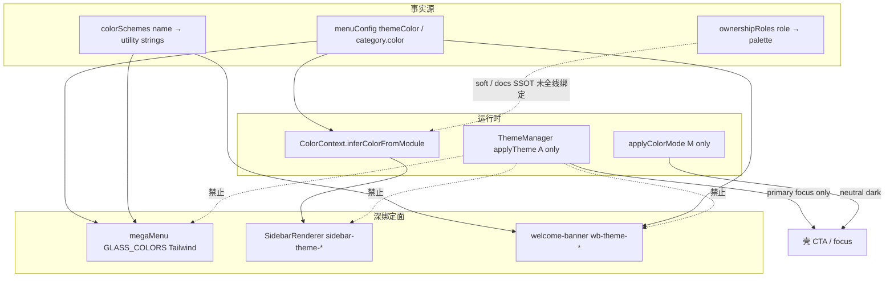

# Ownership 深绑定面深度审查：megaMenu / Sidebar / Welcome Banner

**日期**: 2026-07-26  
**角色**: Tech Lead · Theme Architecture  
**范围**: Layer B 业务绑定导航与身份 chrome（**非** Appearance 全控面）  
**权威链**: `THEME_SYSTEM_GUIDELINES` §2.2 → 本文 → `ownership-role-palette-map` → `ownershipRoles.ts` / `menuConfig` / 实现  
**诚实边界**: 本文**不**要求本轮把 megaMenu 改成 `--color-primary`；**不**关闭 Visual XO。目标是：**主题系统管得住、业务 wayfinding 不崩**。

---

## 0. 一句话结论

| 结论 | 内容 |
| --- | --- |
| **产品正确性** | megaMenu / 左侧栏 / welcome banner **必须**保持 **Layer B Ownership** 多色身份；Appearance 切换只改壳层 primary/focus 与中性面 |
| **系统缺口** | Ownership **有事实源**（`menuConfig` + infer + class 表），但 **三套表达并行**（Tailwind `GLASS_*` / CSS `--sidebar-*` / `--wb-*`），**未**统一到「palette → 语义 token」 |
| **危险方向** | 把导航/banner 收成单一 `--color-primary` = **视觉语言崩溃**（KH rose / MA indigo / PPC emerald 被洗成一套灰/蓝） |
| **正确方向** | **主题系统管理 Ownership palette 与中性 chrome**；业务只声明 **role / palette id**，不各自发明色 |

优先级（不可改）:

```text
状态色 > 模块归属 (B) > Appearance primary (A) > 中性 surface (M)
```

---

## 1. 现状架构（事实）



| 面 | 实现 | 色从哪来 | Appearance 切换时 |
| --- | --- | --- | --- |
| **megaMenu** | `megaMenu.ts` `GLASS_COLORS` | `menuConfig` 模块/分类色名 → 手写 Tailwind 玻璃板 | **身份色不变**；面板表面跟 Color Mode 中性 |
| **left sidebar** | `SidebarRenderer` + `sidebar-renderer.css` | `inferColorFromModule` → `sidebar-theme-{palette}` → **hex 局部 token** | **身份色不变**；背景/文字中性可跟 M |
| **welcome banner** | `welcome-banner.css` `.wb-theme-*` | 模板 class / role 表 `wbThemeClasses` | **归属渐变不变**；勿绑 `--color-primary` |
| **PPC / Deep Chat 等** | 模块局部 `--ppc-*` / terracotta | 产品例外，登记在 role map | Appearance **不得**吞掉 |

**已做对的契约**（保持）:

- `applyTheme` **不**调 `setModuleColor`、不写 Layer B  
- smoke：minimal 后 KH 仍 `wb-theme-rose` / `sidebar-theme-rose`  
- hardcode 门：megaMenu shell blue **13** = 有意 Ownership 基线  
- D8：`ownershipRoles` + soft 测试对齐 menu，**尚未**成为渲染唯一入口  

---

## 2. 深度问题清单（阻碍「主题系统管理」的点）

### P1 — 三套 Ownership 表达，主题系统只「旁观」其中一套

| 通道 | 介质 | 问题 |
| --- | --- | --- |
| megaMenu | Tailwind 字符串表 `GLASS_COLORS` | 色板与 `colorSchemes` / CSS token **双写**；改 palette 要改 TS 大表 |
| sidebar | 每 theme 一组 **硬编码 hex** `--sidebar-*` | 不跟 design-tokens 阶梯；暗色下部分仅靠外壳 `.dark`，身份 hex 偏 light 设计 |
| banner | `.wb-theme-*` CSS 变量块 | 与 sidebar 同 palette 可能 **色值漂移**（rose 侧栏 vs rose banner） |

**影响**: 「主题系统」能管 A/M，对 B 只能靠 **约定 + class 名**，不能像 primary 一样 **一处改 palette 定义、处处消费**。

### P1 — `ownershipRoles` 与渲染脱节

- 文档 / soft test 是 SSOT 叙事  
- **真渲染**仍只认 `menuConfig` + `inferColorFromModule` + 手写 class  
- 扩 role / 纠偏 fuchsia↔rose 时，**菜单 / 侧栏 / banner 可不同步**

### P2 — 双轨色名（已登记，仍是崩溃风险）

| Role | 漂移 | 风险 |
| --- | --- | --- |
| keywords | menu `rose` vs 历史 `fuchsia` banner | 同一业务两套身份 |
| hub-advanced | menu `rose` vs 文档/实现 `violet` | 导航与 banner 不一致 |
| playground | menu `orange` vs Deep Chat terracotta | 正确例外，但需 **永远**挡 Appearance |

### P2 — sidebar / mega 的 focus 与 Appearance focus 混读

- 侧栏 `--sidebar-focus` = 归属色环（正确，B）  
- 壳层 `--color-focus-ring` = Appearance（正确，A）  
- 新人若「统一 focus」会 **误伤** 侧栏身份 focus  

### P3 — Color Mode 下 Ownership 可读性

- 身份色在 dark 下仍用偏 light 的 soft 背景时，**对比可能偏软**  
- 应：**palette 色相锁定**，**明度/表面**跟 M 轴微调 —— 今日未系统化  

### P3 — 入口营销 motion vs 工作台

- megaMenu 允许轻微 translate（入口）  
- workbench 禁 marketing scale（D4）  
- 边界正确，但文档需持续强调，避免「侧栏也加 bounce」  

---

## 3. 目标模型：主题系统「管理 Ownership」而不「吃掉业务」

### 3.1 分层职责（目标态）

| 层 | 主题系统提供 | 业务提供 | 禁止 |
| --- | --- | --- | --- |
| **Palette SSOT** | 每个 `ColorSchemeName` → 语义 token 包：`--own-primary` / `--own-accent` / `--own-soft` / `--own-border` / `--own-focus`（light+dark） | 只选 palette 名或 role id | 业务 hex、复制第三套 rose |
| **Role SSOT** | `ownershipRoles`：module/category → role → palette → 默认 `wb-theme` / `sidebar-theme` 类名 | 新页声明 role 或沿用 menu | 私自 `wb-theme-foo` |
| **Surface recipes** | mega「玻璃」、sidebar「active 条」、banner「渐变 orb」的 **结构 CSS**（无死色） | 内容文案 / 图标 | recipe 内写死 blue-500 业务特例（例外表除外） |
| **Appearance A** | primary/focus 壳 CTA | — | 写入 `--own-*` |
| **Color Mode M** | 中性 nav 底、边框、text；可选 **own-soft 的 dark 覆盖** | — | 改 own-primary 色相 |

### 3.2 切换 Appearance 时「不崩」的验收契约

| 必须变 | 必须不变 |
| --- | --- |
| 顶栏/设置/全局 primary 按钮、壳 focus | mega 卡片模块身份色（KH 入口仍粉、PPC 仍绿…） |
| 中性 surface（尤其 minimal 工业灰） | sidebar active 归属条 / 图标渐变色相 |
| | welcome `wb-theme-*` 归属叙事 |
| | 状态 success/warn/error |
| | Deep Chat terracotta send、PPC hero emerald |

Agent-contract / smoke 已覆盖子集；**人类 XO** 仍要扫「扫读是否乱」。

### 3.3 切换 Color Mode 时「不崩」的验收契约

| 必须变 | 必须不变 |
| --- | --- |
| 导航壳背景、分割线、主 text 对比 | palette **色相**（rose 仍是 rose 家族） |
| own-soft / active-bg **明度**（可读） | role 与 menu 映射 |

---

## 4. 分面处方

### 4.1 megaMenu

**现状**: `GLASS_COLORS` 大表 = Ownership 表现层 + Tailwind 编译期类。  
**目标**:

1. **短期（稳）**: 保持 GLASS 表；文档钉死「B 层」；hardcode 门继续锁 blue 计数。  
2. **中期（管）**:  
   - `getGlassClasses(palette: ColorSchemeName)` 从 **一份 palette recipe** 生成（或 CSS variables + 少量 class）  
   - `menuConfig.themeColor` → palette → recipe；删除与 `colorSchemes` 重复的手工漂移  
3. **禁止**: `iconBg: bg-[var(--color-primary)]` 之类把入口收成 Appearance。

**业务不阻碍**: 产品继续只配 `themeColor: 'rose'`；视觉玻璃效果由 recipe 统一升级。

### 4.2 左侧边栏

**现状**: `sidebar-theme-*` hex 包 + `SidebarRenderer` infer。  
**目标**:

1. **短期**: 渲染路径可选读取 `getPaletteForRole(getOwnershipRoleForModule(id))` **仅当与 menu 一致**；冲突以 **menuConfig 为准**（与现 soft test 一致），打 dev warning。  
2. **中期**: `--sidebar-*` 改为消费 `--own-*-{palette}` 或 `.ownership-palette-rose { --own-primary: … }` 一套变量；dark 用 `[data-color-mode-resolved=dark] .sidebar-theme-rose` 调 soft/border **不改 primary 色相**。  
3. **focus**: 保留 `--sidebar-focus` 跟归属；壳层 focus 仍 Appearance。

### 4.3 Welcome banner

**现状**: `.wb-theme-*` 完整视觉语言；role 表列了 preferred classes。  
**目标**:

1. **短期**: 新页 **只**用 role 表 `wbThemeClasses[0]`；禁止新开未登记 class。  
2. **中期**: banner 渐变 token 与 sidebar own-soft **同源 palette 定义**（同一 rose 的 soft 一致）。  
3. **装饰**: `wb-container--decorative` 仅 overview；工具页 simple/card，避免营销崩工作台。

### 4.4 例外面（永久 B 或品牌）

| 面 | 策略 |
| --- | --- |
| Deep Chat terracotta | **品牌例外**；Appearance 只动 shell chrome；send 永不 primary |
| PPC hero | 局部 `--ppc-search-terms-*`；可登记为 role-ppc surface recipe |
| Status / ErrorBoundary | 状态轴；非 A/B |

---

## 5. 分阶段落地（按收益 / 风险）

### Phase O0 — 文档与契约钉死（低风险 · 已基本具备）

- [x] 宪法 §2.2 导航 = Ownership  
- [x] applyTheme 禁 B；smoke KH rose  
- [ ] **本文**纳入权威链；XO 矩阵写明 mega/sidebar/banner Must NOT  
- [ ] hardcode 门注释：13 = ownership baseline，非 D6 清零目标  

### Phase O1 — 单一读取路径（中收益 · 低视觉风险）

1. `SidebarRenderer` / 文档：infer 与 `ownershipRoles` **一致性 assert**（dev/test，已有 soft → 可升生产 warn）  
2. megaMenu：`GLASS_COLORS` 键 **必须 ⊆ ColorSchemeName**；缺色 fallback 显式  
3. 新模块 checklist：menu themeColor + role 表 + 默认 wb/sidebar class **三件套 PR 模板**  

**不做**: 改任何可见色值。

### Phase O2 — Palette token 包（高收益 · 中风险 · 需视觉抽检）

1. 在 `variables` 或 `ownership-palettes.css` 为每个 palette 定义:

```css
.ownership-palette-rose,
.sidebar-theme-rose,
.wb-theme-rose {
  --own-primary: …; /* 可仍来自设计阶梯 */
  --own-accent: …;
  --own-soft: …;
  --own-border: …;
  --own-focus: …;
}
```

2. sidebar / banner **逐步**改读 `--own-*`，删重复 hex  
3. megaMenu：能 CSS 化的边/底用 token；渐变 icon 可第二步  

**验收**: Appearance minimal/dark 切换 × KH/PPC/MA/Hub **人工扫读**；agent-contract 扩展 assert `--own-primary` 存在且 ≠ 仅 `--color-primary` 当两者角色不同。

### Phase O3 — 双轨收敛（按产品排期）

- keywords：fuchsia → rose（或正式双轨 API，禁止第三名）  
- hub-advanced：violet/rose 二选一  
- playground：terracotta 写入 role notes + token 名，永不进 Appearance  

### Phase O4 — 可选 DOM

- `data-ownership-role` 试点 1 模块（调试 / 自动化）  
- **不**作为换肤必需  

---

## 6. 明确拒绝的方案（防崩溃）

| 方案 | 为何拒绝 |
| --- | --- |
| mega/sidebar 全站 `var(--color-primary)` | 切换 minimal 后 **所有模块变灰**，wayfinding 死 |
| Appearance preset 重写 `menuConfig.themeColor` | 用户换肤 = 改业务信息架构 |
| 删除 `wb-theme-*` 只留 primary CTA | 运营扫读依赖色带身份 |
| 一次重写 GLASS + sidebar + banner | 回归面过大；与 FREEZE 精神冲突 |
| 用 Color Mode 当「第二套品牌色」 | 轴语义污染 |

---

## 7. 与当前 FREEZE / XO 的关系

| 项 | 关系 |
| --- | --- |
| Sample D6 FREEZE | **兼容** — O0/O1 不扩业务 blue 样本 |
| Agent-contract PASS with debt | 证明 A 不冲 B **类级**；O2 仍要人类扫读 |
| 下一步代码 | 优先 **O1 一致性与文档**；O2 需单独里程碑 + 视觉门 |

---

## 8. 建议的「主题系统 API」形状（实现时）

```ts
// 概念 API — 非本轮必交付代码
type OwnershipPalette = ColorSchemeName;

function resolveOwnership(moduleId: string): {
  role: OwnershipRoleId | null;
  palette: OwnershipPalette;
  sidebarClass: string;    // sidebar-theme-rose
  wbClasses: string[];     // wb-theme-rose
  // mega: glass recipe id
};

// ThemeManager: 永不调用 resolveOwnership 的写路径
// SidebarRenderer / megaMenu / banner helpers: 只读 resolveOwnership
```

业务模板:

```html
<div class="wb-container wb-container--simple wb-theme-rose">
  <!-- 或未来: data-ownership-role="role-keywords" + 运行时只加 palette class -->
</div>
```

---

## 9. 成功标准（企业级「管得住 B」）

1. **换 Appearance**: 壳 CTA/focus 变；mega/sidebar/banner **色相身份不变**（自动化 + XO）。  
2. **换 Color Mode**: 中性与 soft 对比达标；身份色相不变。  
3. **新模块**: 只加 menu + role 一行 + 选用已有 palette recipe，**零**新 hex 表。  
4. **改品牌 palette**: 改 **一处** token 包，三面（mega/sidebar/banner）同向更新。  
5. **例外面**（terracotta / status）有登记表，PR 门禁可扫。

---

## 10. 本轮交付

| 交付物 | 路径 |
| --- | --- |
| 本审查 | `docs/superpowers/plans/2026-07-26-theme-ownership-surfaces-deep-review.md` |
| 代码改动 | **无**（架构处方；避免无 XO 的视觉大改） |

**下一步若开工**: 先 **O1**（一致性 assert + PR 清单），再立项 **O2 palette token 包** 并带 KH/PPC/MA 视觉抽检。
